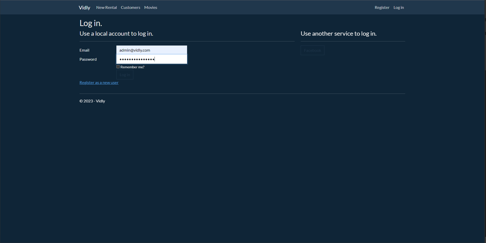
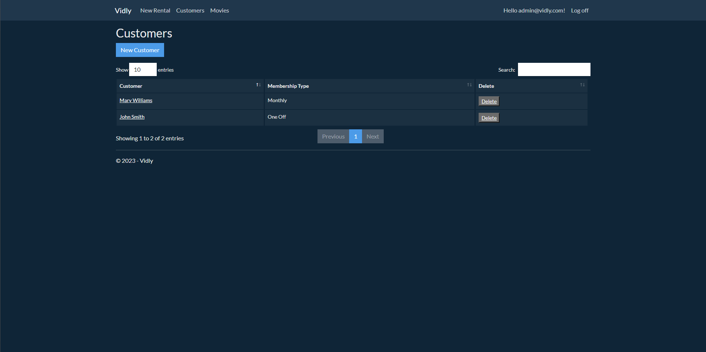
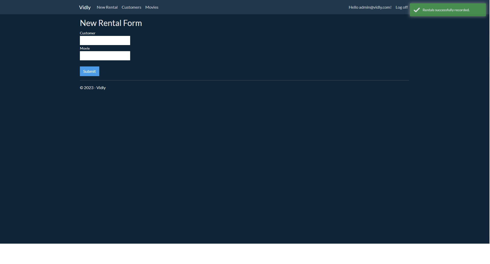
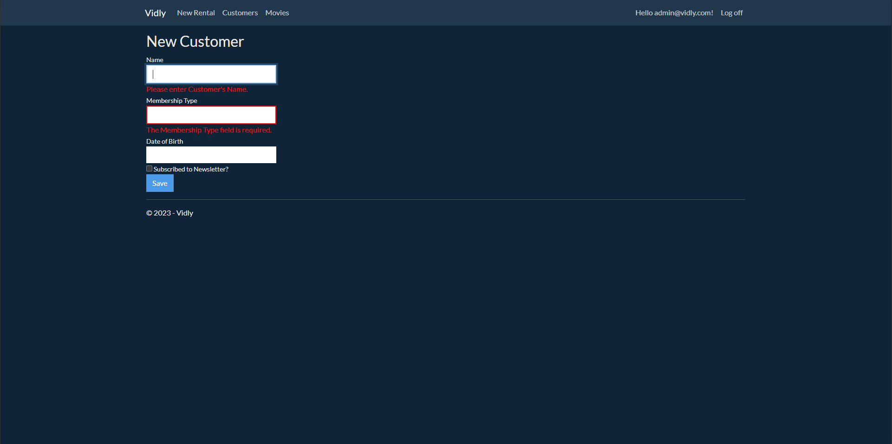
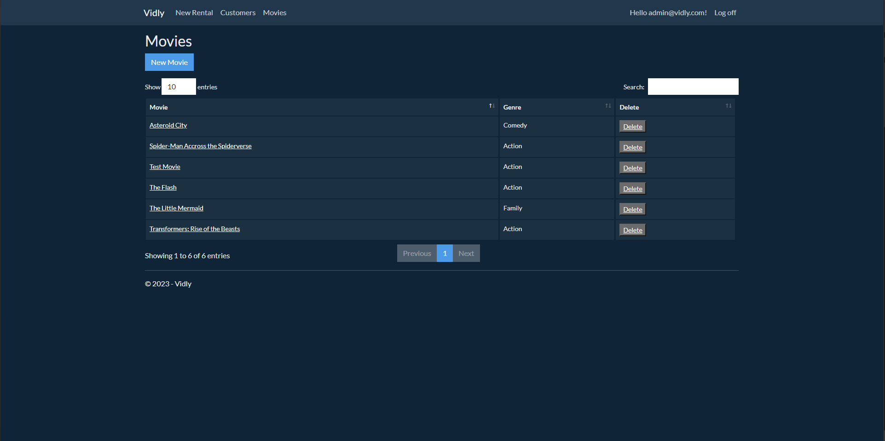
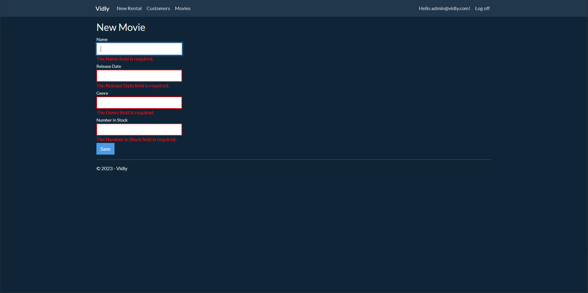

# Vidly

A Video Rental Website that includes User Logins with specific User Roles for different 
permissions. A code first design was used for the Design and Models.

Authentification and Auhtorisation using ASP.NET Identity Framework for Users including 
Facebook Authentification for quick login.

Validation for all forms.

RESTful Services using ASP.NET WEB API,

3rd party packages for various features.

## Table of Contents
- [Technologies Used](#technologies-used)
- [Features](#features)
- [Screenshots](#screenshots)
- [Setup](#setup)
- [Room for Improvement](#room-for-improvement)
- [Acknowledgements](#acknowledgements)

## Technologies Used

- HTML
- CSS
- C#
- .NET
- ASP.NET WEB API
- JQuery
- Bootstrap
- Bootbox
- Respond
- DataTables
- TypeAhead
- Toastr

## Features

- Pagniation and Sorting features for tables of Data.
- Searching functions.
- Add new customers with business rules for age.
- User roles specify whether the user has permissions to read/write.
- Lookup customers using search functions
- Movies have only a number available and will be determined by how many rentals.

## Screenshots

Login Screen with Facebook Authentification

Customers List using BootTable

New Rental Form with Auto Complete with live list of Movies and Customers. Along with Toastr 
popup messages for successful calls and errors.

New Customer Form with validation

Movies List Using BootTable

New Movie Form with Validation

## Setup

- Download or Fork Repository
- In package manager console run 'Update-Database'
- In Web.config under 'appSettings' update the Facebook API KEY and SECRET for facebook authentification login.

## Room for Improvement

- Redesign the HomePage with a logo as it is just a plain RazorView
- Add a movie API to generate a list of movies for the users.
- Update the look.

## Acknowledgements

- Tuturial through Programming with MOSH.